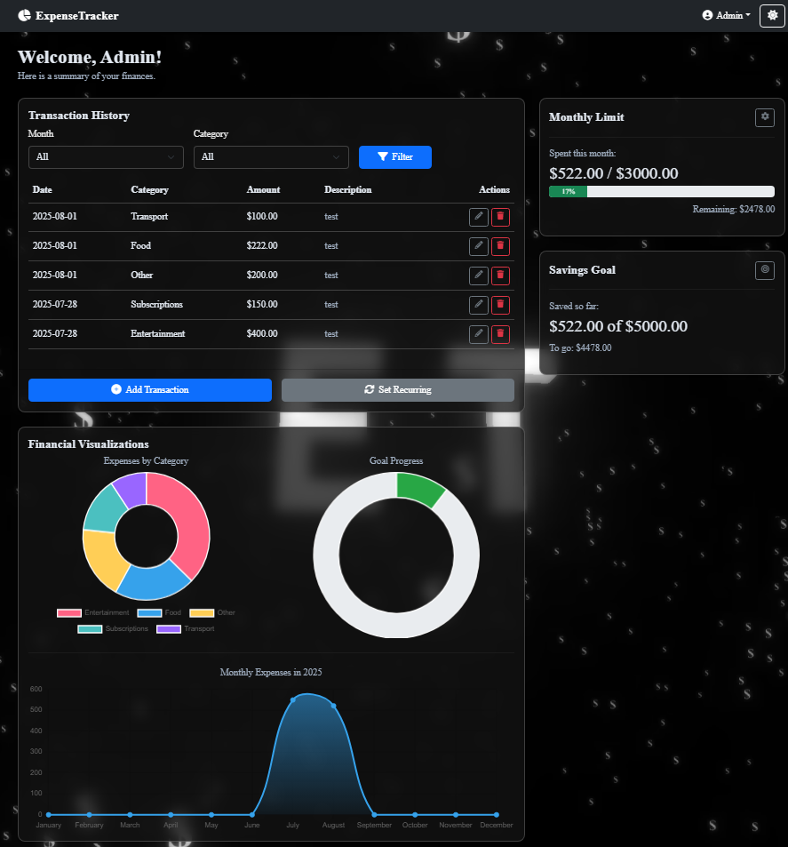
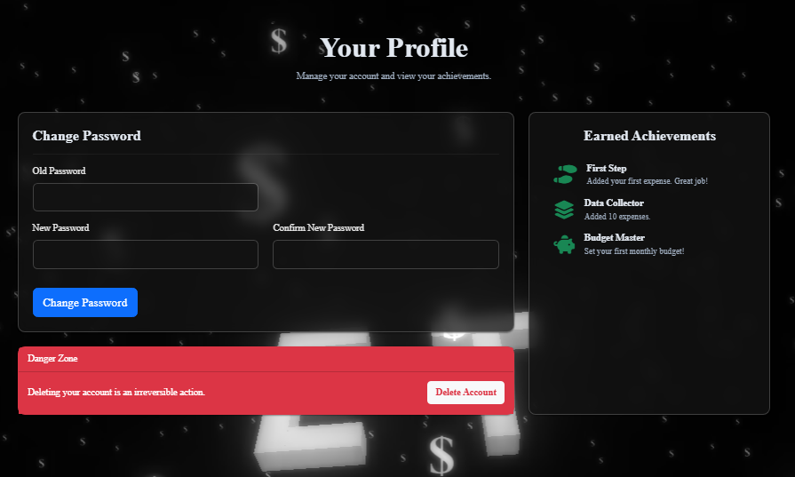
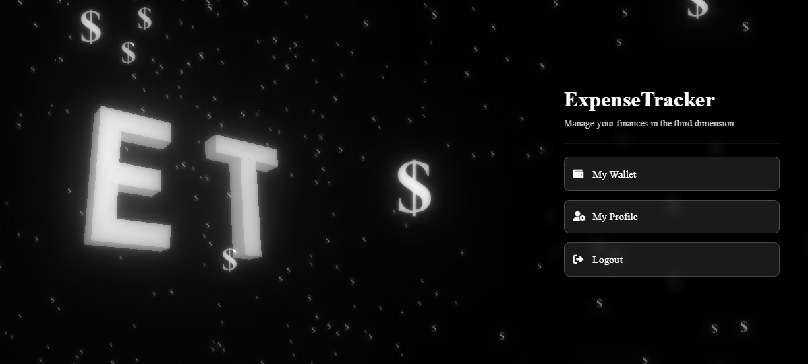
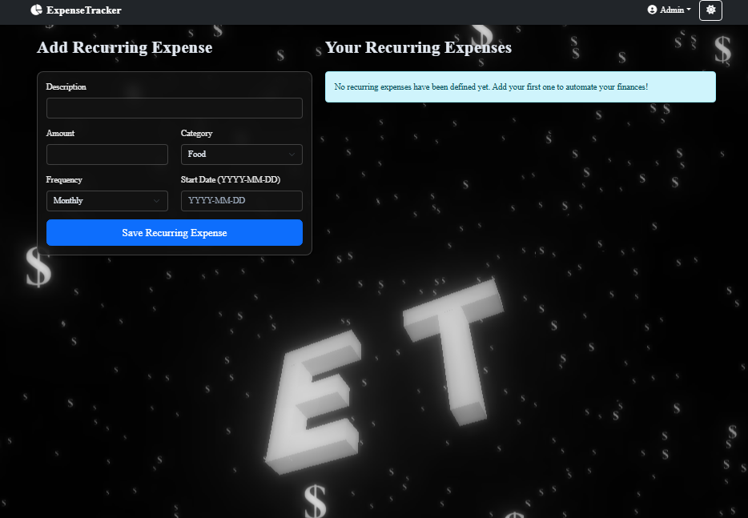

# ExpenseTracker 3D

Educational project ExpenseTracker 3D is a modern, visually-rich web application designed to make personal finance management an engaging and intuitive experience. It combines a robust **Python and Flask backend** with a dynamic, **Three.js-powered 3D frontend**, creating a seamless and immersive user journey.

At its core, the application is built upon a well-structured **relational database managed with SQLAlchemy**. The database schema is designed for scalability and data integrity, handling complex relationships between users, their expenses, recurring transactions, and earned achievements. All interactions, from adding a new expense to tracking savings goals, are powered by efficient and reliable database operations.

The project stands out with its unique, immersive UI, where all interactions happen on top of a live 3D scene

---

### Interactive 3D Experience
The application greets users with a fully interactive 3D landing page and maintains this animated background throughout the user journey, creating a unique and immersive feel. The background features a central 3D logo and animated particles that subtly react to mouse movements.

**

---

##  Features

The application is packed with features to provide a complete personal finance toolkit.

*   **Secure User Authentication:** Users can register and log in to a secure account. All password data is hashed and safely stored.
*   **Immersive 3D Background:** A persistent, interactive 3D background provides a unique aesthetic across the entire application, including the login, dashboard, and profile pages.
*   **Central Hub Navigation:** The home page acts as a beautiful, animated hub for navigating to the main parts of the application.
*   **Expense Management:** Full CRUD (Create, Read, Update, Delete) functionality for daily expenses.
*   **Recurring Transactions:** Set up recurring expenses (like rent or subscriptions) that are automatically added to your transaction history.
*   **Budgeting & Goals:**
    *   **Monthly Limit:** Set a monthly spending limit and track your progress with a visual bar.
    *   **Savings Goal:** Define a savings goal and monitor how close you are to achieving it.
*   **Data Visualization:** The wallet/dashboard includes:
    *   Donut chart for expense breakdown by category.
    *   Progress chart for the savings goal.
    *   Line chart showing monthly spending throughout the year.
*   **Gamification System:** Earn achievements for reaching financial milestones (e.g., adding your first expense, staying within budget). Achievements are celebrated with animated, satisfying pop-up notifications.
*   **Dynamic Filtering:** Easily filter transactions by month and/or category.
*   **Light/Dark Mode:** Instantly switch between a light and dark theme for comfortable viewing.

---

##  Screenshots

Here’s a example closer look at the application's interface.

### Main Dashboard 
**

### User Profile & Achievements
**

### Login Page
**

### Home page
**

### Reccuring Expense
**

---

##  Technologies & Libraries

This project was built using a modern stack of technologies:

#### Backend
*   **Python:** The core programming language.
*   **Flask:** A lightweight WSGI web application framework.
*   **Flask-SQLAlchemy:** For database interaction and object-relational mapping (ORM) with SQLite.
*   **Flask-Login:** To manage user sessions and authentication.
*   **python-dotenv:** To securely manage environment variables.

#### Frontend
*   **HTML5 & CSS3:** For structure and advanced styling, including glassmorphism effects.
*   **JavaScript (ES6+):** For client-side interactivity and 3D rendering.
*   **Three.js:** The core library for creating and displaying animated 3D graphics in the browser (using WebGL).
*   **Bootstrap 5:** For a responsive layout and pre-built UI components.
*   **Chart.js:** To create beautiful and informative charts.
*   **SweetAlert2:** For elegant, animated pop-up notifications (achievements and system messages).
*   **Vanilla-Tilt.js:** For the subtle 3D tilt effect on UI panels.

---
## What I Learned

This educational project was a significant learning experience, bridging the gap between backend logic and advanced frontend visuals. Here are some of the key takeaways:

*   **Full-Stack Integration:** Deepened my understanding of how to build a complete web application from scratch, connecting a Python/Flask backend with a dynamic, JavaScript-driven frontend.
*   **Advanced Frontend with Three.js:** Gained hands-on experience in implementing complex 3D graphics in the browser. This included:
    *   Setting up a scene with cameras, lighting, and a renderer.
    *   Creating generative 3D objects (like the logo) directly in code.
    *   Implementing particle systems for atmospheric effects.
    *   Using post-processing effects like `UnrealBloomPass` to achieve a professional, polished look.
    *   Handling user interaction (mouse tracking) to create a dynamic and responsive 3D environment.
*   **Database Management:** Learned to design and manage a multi-table database using Flask-SQLAlchemy, including handling relationships (one-to-many, many-to-many) and cascading deletes for data integrity.
*   **UI/UX Design & CSS:** Developed skills in creating a cohesive and modern user interface, implementing a "glassmorphism" aesthetic with `backdrop-filter`, and ensuring a consistent user experience across different pages and in both light and dark modes.
*   **Project Management & Debugging:** This educational project was a lesson in perseverance. Overcoming numerous technical challenges, from fixing CORS errors to debugging silent JavaScript failures, significantly strengthened my problem-solving skills and taught me the importance of iterative development and testing.

**Author:** [Jakub](https://github.com/jakubsmigielski)  
**Educational portfolio project** 
