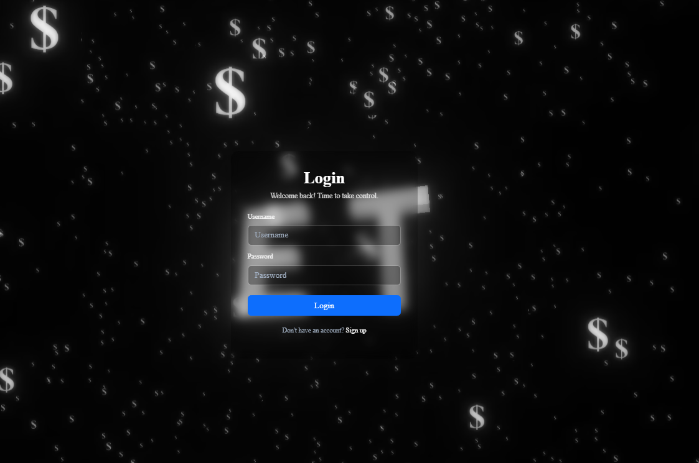

# ExpenseTracker 3D

Educational project ExpenseTracker 3D combines a powerful Python/Flask backend with an immersive Three.js frontend to create an engaging personal finance tool. At its core, a well-structured relational database, managed by SQLAlchemy, handles all user data, transactions, and achievements with efficiency and integrity. The entire UI is rendered over a live 3D scene, offering a unique user experience.

### Interactive 3D Experience
The application greets users with a fully interactive 3D landing page and maintains this animated background throughout the user journey, creating a unique and immersive feel. The background features a central 3D logo and animated particles that subtly react to mouse movements.

**

##  Features

The application is packed with features to provide a complete personal finance toolkit.

*   **Secure User Authentication:** Users can register and log in to a secure account. All password data is hashed and safely stored.
*   **Immersive 3D Background:** A persistent, interactive 3D background provides a unique aesthetic across the entire application, including the login, dashboard, and profile pages.
*   **Central Hub Navigation:** The home page acts as a beautiful, animated hub for navigating to the main parts of the application.
*   **Expense Management:** Full CRUD  functionality for daily expenses.
*   **Recurring Transactions:** Set up recurring expenses that are automatically added to your transaction history.
*   **Budgeting & Goals:**
    *   **Monthly Limit:** Set a monthly spending limit and track your progress with a visual bar.
    *   **Savings Goal:** Define a savings goal and monitor how close you are to achieving it.
*   **Data Visualization:** The wallet/dashboard includes:
    *   Donut chart for expense breakdown by category.
    *   Progress chart for the savings goal.
    *   Line chart showing monthly spending throughout the year.
*   **Gamification System:** Earn achievements for reaching financial milestones. Achievements are celebrated with animated, satisfying pop-up notifications.
*   **Dynamic Filtering:** Easily filter transactions by month and/or category.
*   **Light/Dark Mode:** Instantly switch between a light and dark theme for comfortable viewing.

##  Screenshots

Here’s a example closer look at the application's interface.

### Main Dashboard 
**

### User Profile & Achievements
**

### Login Page
**

### Home page
**

### Reccuring Expense
**

##  Technologies & Libraries

This project was built using a modern stack of technologies:

#### Backend
*   **Python** 
*   **Flask** 
*   **Flask-SQLAlchemy** 
*   **Flask-Login** 
*   **python-dotenv**

#### Frontend
*   **HTML & CSS**
*   **JavaScript** 
*   **Three.js** 
*   **Bootstrap 5**
*   **Chart.js** 
*   **SweetAlert2** 
*   **Vanilla-Tilt.js**

## What I Learned

This educational project was a deep dive into full-stack web development, focusing on the synergy between a data-driven backend and an interactive 3D frontend.
- Full-Stack Architecture: Gained proficiency in connecting a Flask backend with a JavaScript-driven frontend, managing everything from user authentication to API-like data flow.
- Advanced Three.js Implementation: Mastered key 3D techniques, including generative geometry, particle systems, post-processing effects (UnrealBloomPass), and creating a responsive 3D environment that reacts to user input.
- Database Design: Acquired practical experience in designing and managing a relational database with Flask-SQLAlchemy, successfully implementing one-to-many and many-to-many relationships.
- Modern UI/UX: Honed my CSS skills by building a cohesive "glassmorphism" interface with light/dark modes and a focus on user experience.

---
**Author:** [Jakub](https://github.com/jakubsmigielski)  
**Educational portfolio project** 
